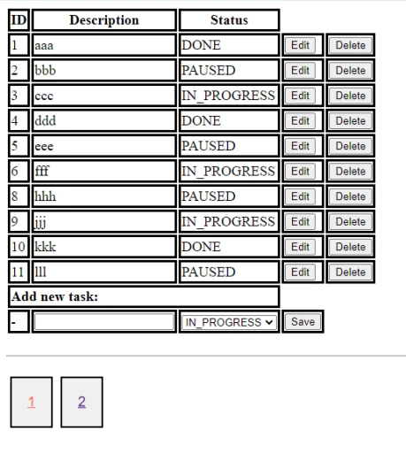

Мини проект от JavaRush по теме "CRUD на Spring MVC".


>CRUD на Spring MVC
>
>Нужно сделать список задач (todo-list) с возможностью просматривать список задач, добавлять новые задачи, 
>редактировать и удалять существующие задачи.
>


Для запуска выполнить sql скрипт (mysql.sql) и выполнить команды:
``` bash
mvn clean install && docker compose up
```

Проект будет доступен по URL: [http://localhost:8080/root/](http://localhost:8080/root/)